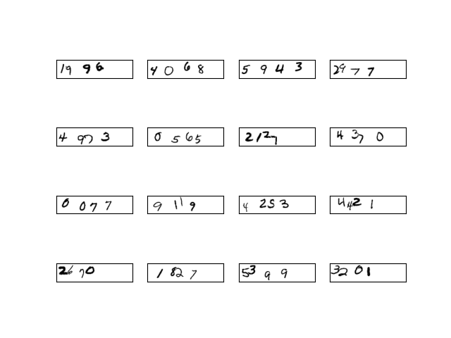
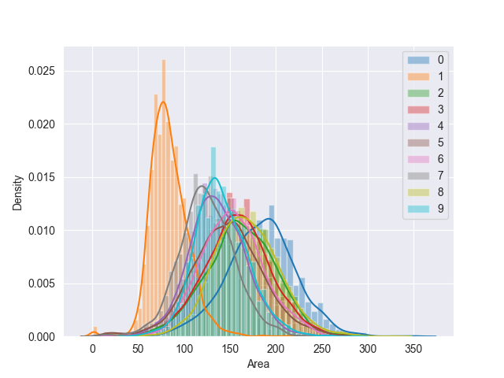
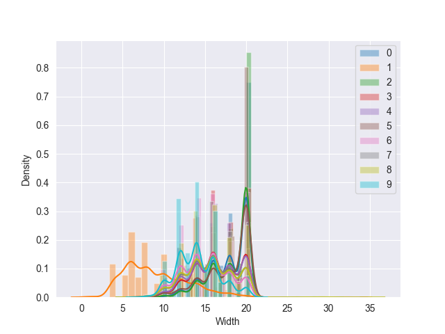
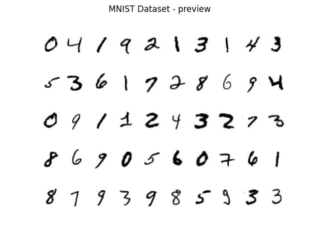
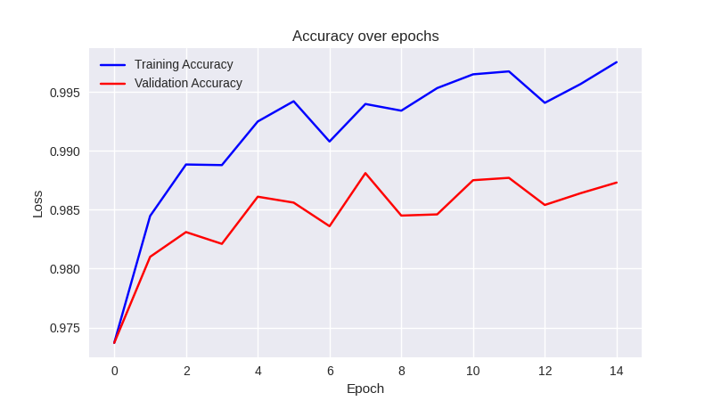
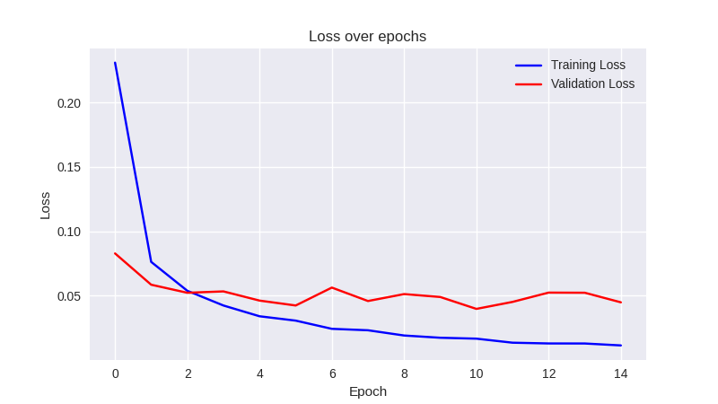
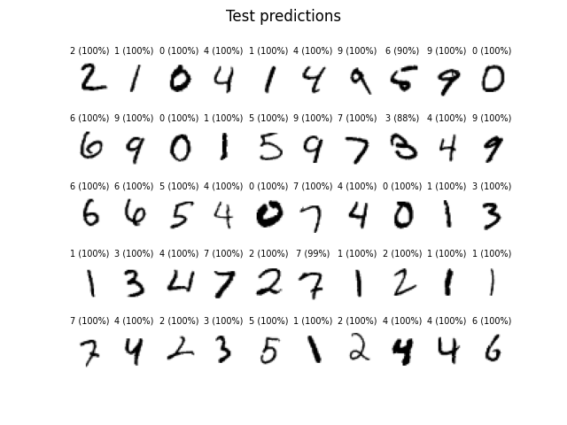
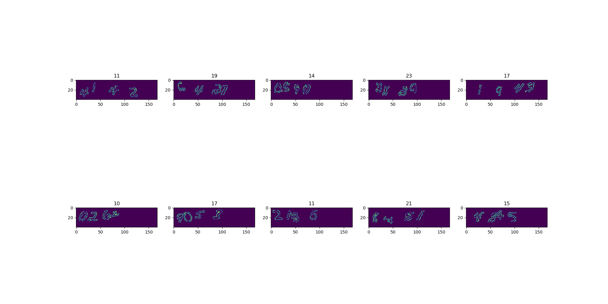

# Deep Learning Digit Sum

## Introduction
A Deep Learning model to find the sum of handwritten digits present in an image. The model trains on the primitive MNIST Dataset containing 60000 images. This trained model is used to detect the digits present in the test image containing multiple handwritten digits.

## Dataset
The dataset consists of images of size 40 x 168 having 4 handwritten digits. These digits may or may not be spaced out. The model is tested on a total of 30000 images present in the dataset and acheives as accuracy of 78%.



## Flow
The complete model consists of two significant parts - Segmentation and Prediction. In the segmentation part, the original image is parsed and the multiple digits are extracted as individual. This individual digit is then fed into the trained model for prediction. The results are then added and the final sum is returned for matching with their correponding labels.

### Segmentation
The segmentation of isolated digits are quite simple and is done with the use of cv2's connected components module. However for digits that are joined into each other, different heuristics are used such as to separate them. These heuristics have been formed by the use of metrics that are calculated by statistically examining the correct results that the model has been able to achieve until then.




### Model
For the MNIST model, we have used LeNet model that uses 3 convolution layers for feature extraction which is finally fed into a classifier composed of 2 linear layers. This is trained over the standard MNIST dataset for 15 epochs with batch size of 32. Upon testing with the MNIST Test data composed of 10000 images, it yields over 98% accuracy.




#### Plots
The simple MNIST model is able to acheive over 98% accuracy with the following plots for Accuracy and Loss between the training and validation sets.




#### MNIST Results
Accuracy on the test sets for the MNIST model reach over 98% with the some of the accurate results shown as below



## Results
For the complete dataset containing 30000 images the model showed the accuracy of 78.063%
Few of the correct results are shown in the following image.




## Execution Instruction
To check the accuracy of any dataset, load the dataset in the form of numpy images and labels and then call the `test_set(model, imgs, labels)` function in the `multi_digit_test.py` file specifying the model which can be loaded from `model.dth` and the imgs and labels. Then execute the following statements:
```
pip3 install -r requirements.txt
python3 multi_digit_test.py
```