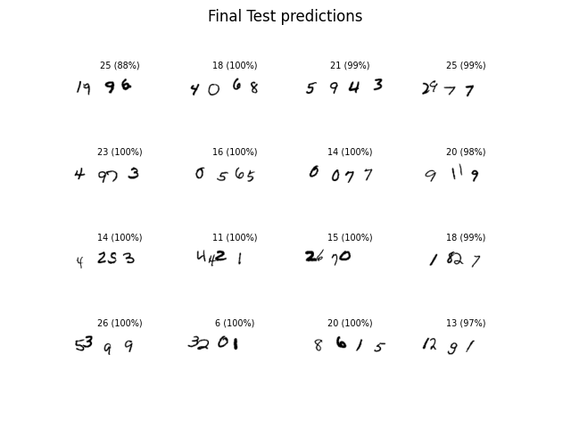

# Deep Learning Digit Sum

## Introduction
This is an endeavour to create a deep learning model to evaluation the sum of handwritten digits in an image. The dataset provided is a 168 x 40 sized image containing 4 digits side by side, whose sum is labelled in the dataset.

## Model
A simple sequential model with linear layers with 2 hidden layers has been used. Only aim now is to overfit the network to acheive high training accuracy.

## Plots


## Results
Accuracy on the Test Set is about 5%


## Execution Instruction

```
pip3 install -r requirements.txt
python3 digit_sum.py
```